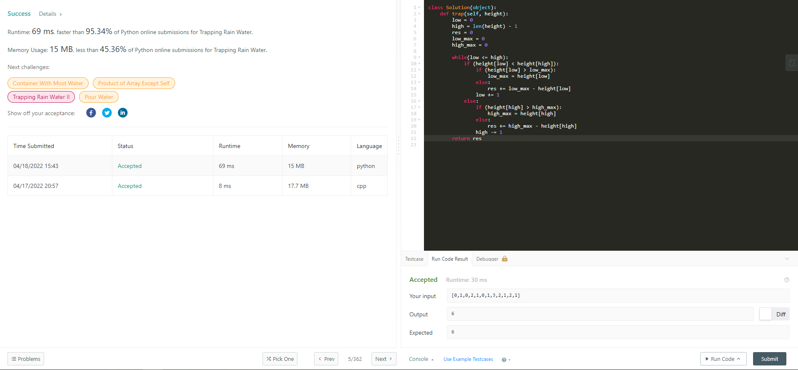
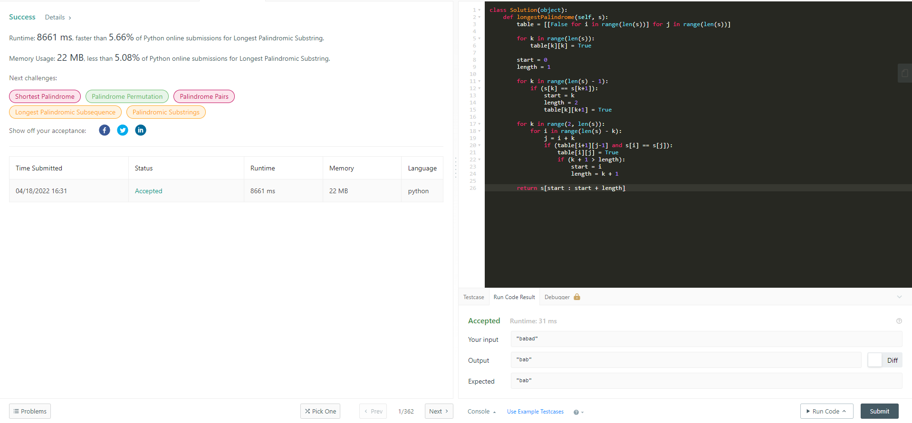
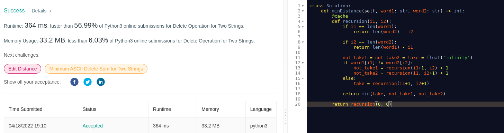
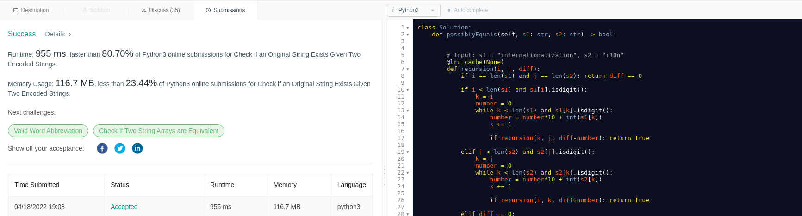

Temas:
 - PD

# PD_Dupla27

**Número da Lista**: 5 
**Conteúdo da Disciplina**: PD - Programação Dinâmica 

## Alunos
|Matrícula | Aluno |
| -- | -- |
| 16/0120918  |  Gabriel de Jesus Carvalho |
| 18/0054554  |  Paulo Batista |

## Sobre 
Neste projeto foram resolvidas algumas questões do LeetCode sobre programção dinâmica.

## Screenshots
### Tapping Rain Water

A questão pode ser acessada pelo link: https://leetcode.com/problems/trapping-rain-water/

### Longest Palindromic Substring

A questão pode ser acessada pelo link: https://leetcode.com/problems/longest-palindromic-substring/

### Delete Operation For Two Strings

A questão pode ser acessada pelo link: https://leetcode.com/problems/delete-operation-for-two-strings/

### Check If An Original String Exists Given Two Encoded Strings

A questão pode ser acessada pelo link: https://leetcode.com/problems/check-if-an-original-string-exists-given-two-encoded-strings/

## Instalação 
**Linguagem**: Python 

As questões do LeetCode podem ser testadas pelo próprio site, mas se preferir rodar localmente, é necessário ter o Python instalado.

## Uso 
Para testar as questões, é necessário ir ao site de cada questão, copiar e colar a solução e rodar ou submeter a questão.

[Tapping Rain Water](https://leetcode.com/problems/trapping-rain-water/)  
[Longest Palindromic Substring](https://leetcode.com/problems/longest-palindromic-substring/)  
[Delete Operation For Two Strings](https://leetcode.com/problems/delete-operation-for-two-strings/)  
[Check If An Original String Exists Given Two Encoded Strings](https://leetcode.com/problems/check-if-an-original-string-exists-given-two-encoded-strings/)  

<!-- ## Outros 
Quaisquer outras informações sobre seu projeto podem ser descritas abaixo. -->

